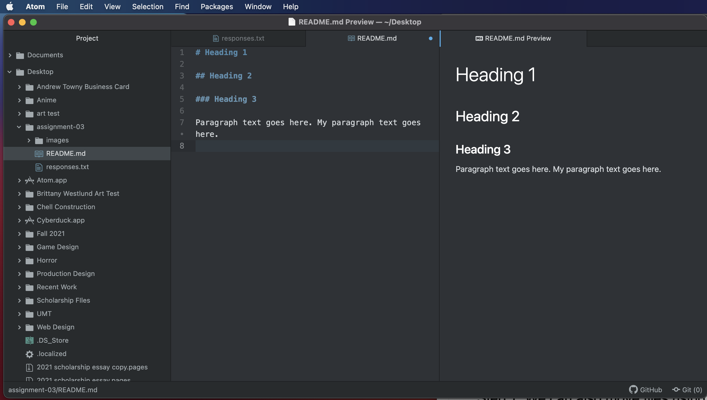

# Markdown

#### Three Things I Have Learned So Far

1. How to create directories, subdirectories, and files in Atom and that they will also be located on my computer's hard drive.

2. How to code headings, links, lists, and text styles such as **bold** and *italic* in markdown.

3. How to upload a directory to GitHub. I also learned about the internet vs the world wide web, relative and absolute URLs and IP addresses.

[My Responses](./responses.txt)

