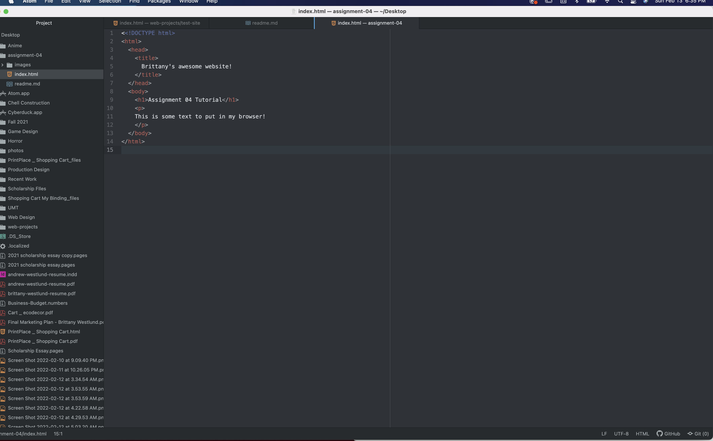

### Browsers

Browsers are software programs that communicate with servers over the network to display webpages to viewers. The rendering engine of the browser is responsible for constructing the webpage by interpreting html and css files. Javascript is interpreted by a javascript interpreter. I use the following browsers:

1. Chrome
2. Safari
3. Firefox

