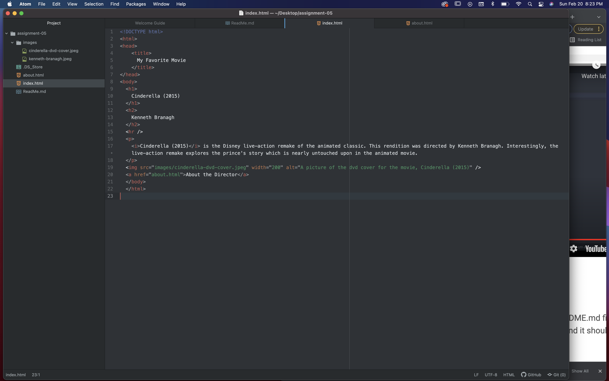

### The Wayback Machine

The website I visited was RiflePaperCo.com from January 2010. In 2010, the website featured a lot of white, sans-serif headers, and serif body text. There are 4 prominent photos on the Home page. There are two different navigation areas, along the top and along the left side of the page. The current 2022 design omits the left navigation area and centers the main heading and navigation links. The current version also utilizes a longer Homepage than the 2010 version and makes room for promotions, best sellers, and a preview of the About page. Finally, the new version uses primarily sans-serif text throughout. Overall, the new version of this website shifts from more of an arts-and-crafts feel (the inclusion of the hand-drawn dog logo on the older version gives the website a whimsical, artisan feel) to a more contemporary, upscale look. Even though the design wasn't terrible in 2010, I think the current version helps the product feel more expensive.
