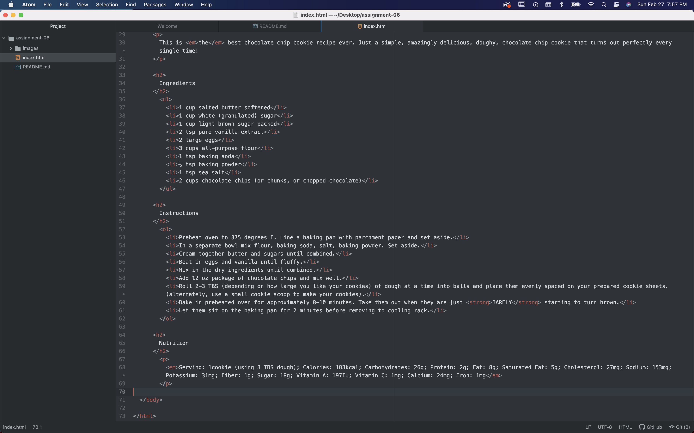

### Semantic and Structural Markup

Structural markup is used to embed the structural information of a document whereas Semantic markup reinforces the meaning of the information within a document. Structural markup helps us organize our webpages and Semantic markup helps us deliver our content in an engaging way. An example of Structural markup is a heading or a list. An example of Semantic markup would be to add emphasis to a word or phrase.
