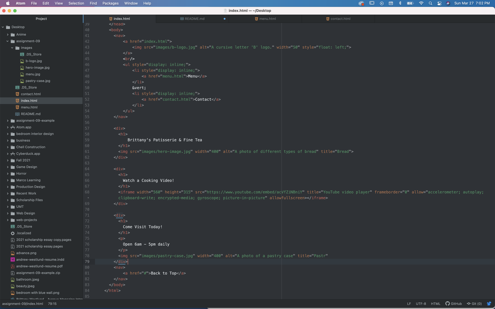

### HTML Recap

My experience learning HTML was really enjoyable for the most part. I have taken web classes in the past and this was a perfect refresher. The most difficult aspect for me was all of the small details that go into developing a website. I love the tutorial videos!

I'm excited to move into CSS because I remember that being my favorite part of my previous web classes. I would love it if we explored things like parallax and other trends.
