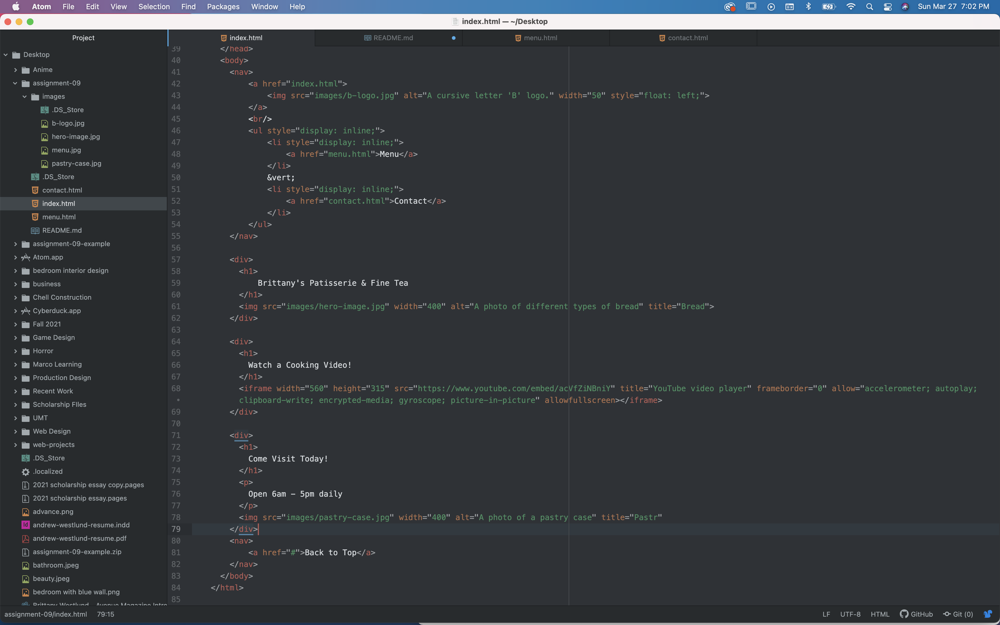

### CSS

Describe the difference between the universal, element, class, and id selector types. When might you choose one over the other to style content?

Starting with the universal selector, this is used when a developer wants to style every element on a webpage. On the other hand, the element selector is used to select elements of a certain type (i.e. h3).
Classes allow developers to style elements that serve the same function. Finally, IDs allow developers to single out and style an element. It depends which type of element a developer is working with to determind which selector to use. For example, to style all h2 elements then the devloper would choose a class. If they wanted to single out a specifc paragraph, the developer would use an ID.

Discuss your color palette. How did you choose your colors?

I primarily went with a monochromatic color palette that includes an off-white color. I wanted to keep the website cohesive and to use the various tints of pink-red to impart repetition into my design. I started with the darkest color and worked out the other colors from there.
