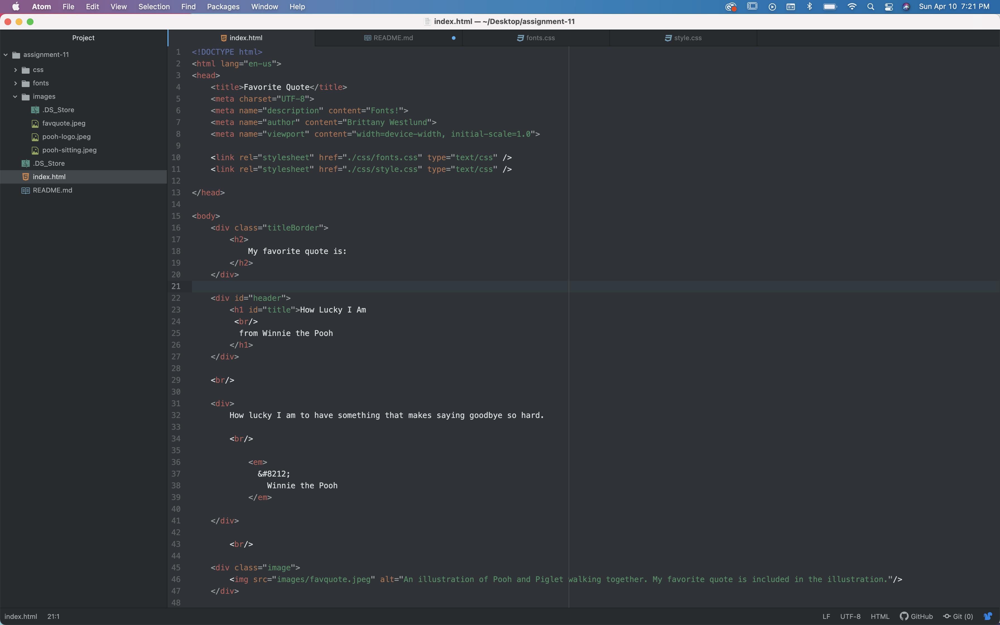

## What is typography?
Typography is the written component of the spoken word. In design, extra care is taken to elicit different reactions to the same words being presented in different ways.

## What is the importance of having fallback fonts or a font stack?
With a fallback font, you are able to deliver a cleaner interaction with your end user and their system when something goes wrong, like a letter or a symbol not being recognized. Instead of displaying a square, a question mark or nothing at all, you can ensure that even if the character or symbol displayed wasn’t the one intended, it would be far better than the alternative.  

## What is the difference between a system font, web font, and web-safe font?
A system font is installed directly onto the device from setup. Web fonts are fonts that are installed after initial setup, differentiating them from the pre-installed ones, and adding a layer of customization to our writing. A web-safe font is one of the fonts that are pre-installed on quite the majority of devices, making them very accessible for cross-device communication.
