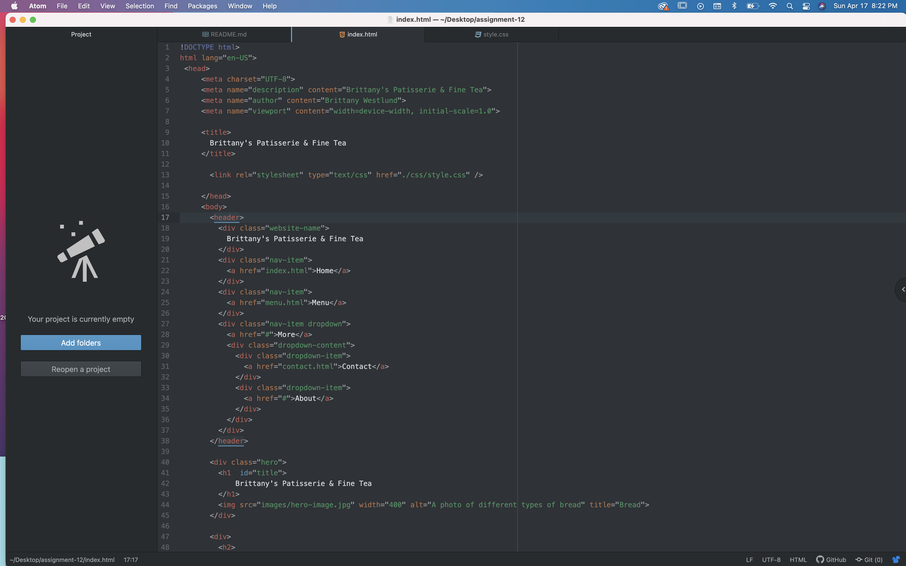

### Padding, Margin, and Borders

1. Padding refers to the space between the content inside a box and its border. The border refers to the outer edge of a box (which contains content). Margin refers to the space beyond a box's border.
