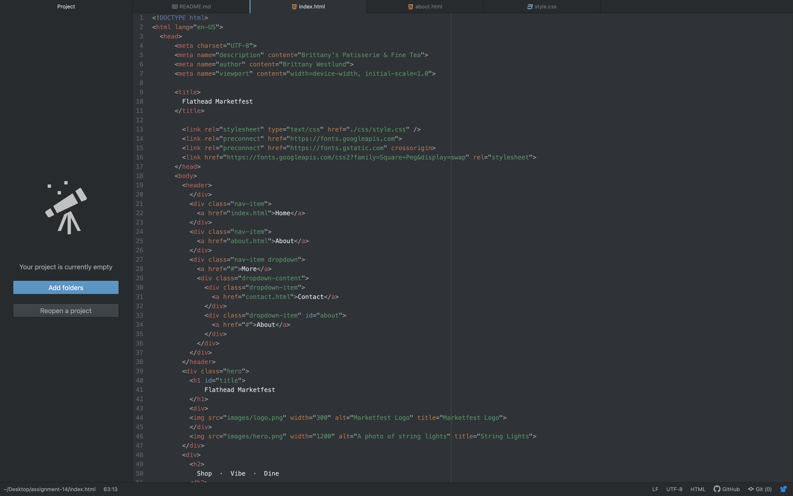

### User Testing

How did your user testing sessions go?
They went well. I made my questionnaire simple and the feedback that I got was really helpful. I didn't think of adding a calendar of events or photo gallery but now I will consider it.

What changes (if any) did you make to your website based on the user feedback you received?
I've collected more photos for the photo gallery. I plan on adding this page (currently only the About page has been worked on other than the homepage.)

Optional: What challenges did you face this week, and how did you overcome them?
I was a challenge to get all of my pages done, but once I finalize the About page, then I can duplicate it and I think things will pick up.
